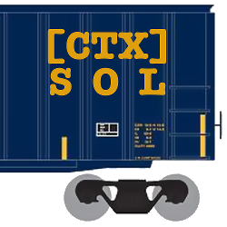

# ctxsol



*An Erlang/LFE Solaris Container/Zones Library*

## Introduction

More to come ...


## Installation

Just add it to your ``rebar.config`` deps:

```erlang
    {deps, [
        ...
        {ctxsol, ".*", {git, "git@github.com:billosys/ctxsol.git", "master"}}
      ]}.
```

And then do the usual:

```bash
    $ rebar get-deps
    $ rebar compile
```


## Usage

All, in time ...
